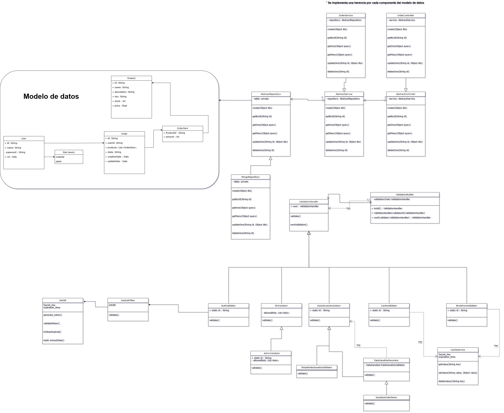

# Analisis de problema de diseño
### Implementación en spring boot de un sistema de ordenes
**Enunciado:**

>Supongan que están trabajando en un cliente que se conecta a un sistema para hacer ***órdenes*** en línea. Ustedes quieren **restringir** acceso al sistema para que solo los ***usuarios*** autenticados puedan crear órdenes. Además, los usuarios que tienen ***permisos*** administrativos deben tener acceso total al sistema.

>Después de un rato de planeación, se dan cuenta de que estas **verificaciones** se deben realizar de forma secuencial. La aplicación intenta **autenticar** un usuario cuando recibe una solicitud que contiene las credenciales del usuario, sin embargo, si dichas credenciales no son correctas y la autenticación falla, no hay razón para proceder con otras verificaciones.

>Durante las siguientes semanas, implementan algunas verificaciones adicionales:
> - Alguien les sugiere que no es seguro pasar datos crudos directo al sistema de solicitudes. Así que usted adiciona una validación extra para **sanear** los datos en la solicitud.
> - Después, alguien nota que el sistema es vulnerable a ataques de **‘fuerza bruta’**. Para evitar esto, usted adiciona una verificación que filtra solicitudes fallidas repetidas que vienen de la misma dirección IP.
> - Alguien más sugiere que se podría incrementar la velocidad de respuesta del sistema si se retornan resultados **‘cacheados’** para solicitudes repetidas que contienen los mismos datos. Por lo tanto, ustedes adicionan otra verificación que deja pasar la solicitud por el sistema solo si no hay una respuesta adecuada cacheada.

> Ustedes deben diseñar el cliente siguiendo los pasos descritos en el enunciado y considerando que es muy probable que a futuro les pidan **adicionar** nuevas verificaciones o que dichas verificaciones se puedan **reutilizar** en otros clientes que requieran usar el sistema de órdenes en línea.

#  **Diseño de la solución:**

[🔗 Ver diagrama en Draw.io](https://app.diagrams.net/#G1v-2egTh279Uh33IUOpJGmT3j4a6Ld7kJ#%7B%22pageId%22%3A%22C5RBs43oDa-KdzZeNtuy%22%7D)

# ¿ Comó utilizar la implementación?
> Puedes acceder de manera sencilla a la solución implementada sin necesidad de clonar el respositorio, simplemente entra en el release: [🔗 Docker Compose Release]( https://github.com/AdrianPerdomoE/orders_system/releases), ahi encontraras el archivo docker-compose.yml, asegurate de tener docker instalado en tu maquina, corre el comando y una vez montadas las imagenes y los contenedores esten funcionando, podras acceder a la documentación de la API en [🔗Swagger ](http://localhost:8080/swagger-ui/index.html)
>  Tambien puedes usar el comando docker-compose up -- build en la ruta raiz del proyecto para montar las imagenes pero deberas utilizar tus propios valores secretos de configuracion, podras encontrar que valores requires utilizar en el archivo envTemplate.text  y deberas crear un archivo de inicializacion para el mongo si lo trabajaras con la imagen local, sigue el siguiente formato:
****


```javascript
db = db.getSiblingDB('admin');
          if (db.system.users.find({ user: "Admin" }).count() === 0) {

            db.createUser({
              user: "Admin",
              pwd: "contraseña",
              roles: [
                { role: "readWrite", db: "orders_system" },
                { role: "dbAdmin", db: "orders_system" }
              ]
            });
            print("User 'Admin' created successfully.");
          } else {

            db.updateUser("Admin", {
              roles: [
                { role: "readWrite", db: "orders_system" },
                { role: "dbAdmin", db: "orders_system" }
              ]
            });
            print("User 'Admin' already exists. Roles updated successfully.");
          }


          db = db.getSiblingDB('orders_system');


          if (!db.getCollectionNames().includes("products")) {
            db.createCollection("products");
            print("Collection 'products' created.");
          }

          if (!db.getCollectionNames().includes("orders")) {
            db.createCollection("orders");
            print("Collection 'orders' created.");
          }

          if (!db.getCollectionNames().includes("users")) {
            db.createCollection("users");
            print("Collection 'users' created.");
          }

          print("Database 'orders_system' initialized successfully.");
```


***

~~~
En swagger estará abierto el endpoint para crear usuarios en el sistema, eso para poder realizar pruebas, estará abierta la autenticación para los endpoints que requieren validación por roles, a continuación listo los roles disponibles:
~~~
- admin
- customer  
~~~
Por defecto, iran unos productos creados en el sistema para poder realizar pruebas, se pueden agregar más, eliminar los incluidos, pero tener en cuenta que si el sistema de la app detecta que no hay ningun producto volvera a generar los por defecto. Tambien, importante para las Queries, los operadores posibles son:
~~~
- equals
-  not_equals
-   greater_than
-  less_than
- in
- not_in
- like
- between
